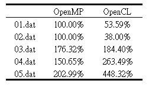

# Parallel-computing-hw06
In assignment #4, we have implemented data normalization & cross validation with kNN. In this assignment, we are
going to most steps of kNN & n-fold cross validation with OpenCL.

## Dependencies
* Ubuntu
* g++
* Valgrind 
* OpenCL

## Setup
```sh
make all        -- Produce executable file

-- Feed dataset 01 to 05 and get results
make 01
make 02
make 03
make 04
make 05
```

## Analysis

Table 1. The execution time comparison of the OpenCL version and the standard version.(Unit: sec)
<!-- Table01 -->
<br />
        <p align="left">
                       
        </p>
<br/>
Table 2. The execution time comparison of the OpenMP version and the OpenCL version. (Unit: sec)
<br />
<br/>
<!-- Table02 -->
<br />
        <p align="left">
                       
        </p>
<br/>
Table 3. Visualization of these two accelerated version comparison.
<!-- Table03 -->
<br />
        <p align="left">
                       
        </p>
<br/>

## Folder Structure
* Data is saved into the `data` folder.
* Header files is saved into the `inc` folder.
* Code is saved into the `src` folder.

## Contact

Abbey, Chen - encoref9241@gmail.com

Project Link: [Parallel-computing-hw06](https://github.com/EasternGD/Parallel-computing-hw06.git)
